# Payment Gateway with Multi-Method Processing and Hosted Checkout

A comprehensive payment gateway solution similar to Razorpay or Stripe, featuring merchant onboarding, payment order management, multi-method payment processing (UPI and Cards), and a hosted checkout page.

## 🎬 Demo Video

[](https://youtu.be/vRIZp9uqg4g)

Watch the full demo: [https://youtu.be/vRIZp9uqg4g](https://youtu.be/vRIZp9uqg4g)

## 🏗️ Architecture Overview

```mermaid
graph TB
    subgraph "Payment Gateway System"
        subgraph "Frontend Layer"
            D[💻 Dashboard<br/>React - Port 3000]
            C[🛒 Checkout Page<br/>React - Port 3001]
        end
        
        subgraph "Backend Layer"
            API[⚙️ API Server<br/>Node.js/Express - Port 8000]
        end
        
        subgraph "Data Layer"
            DB[(🗄️ PostgreSQL<br/>Port 5432)]
        end
    end
    
    D -->|REST API| API
    C -->|REST API| API
    API -->|SQL Queries| DB
    
    style D fill:#61dafb,stroke:#333,stroke-width:2px
    style C fill:#61dafb,stroke:#333,stroke-width:2px
    style API fill:#68a063,stroke:#333,stroke-width:2px
    style DB fill:#336791,stroke:#333,stroke-width:2px
```



### System Components Interaction

```mermaid
graph LR
    subgraph "External"
        M[🏪 Merchant]
        CU[👤 Customer]
    end
    
    subgraph "Payment Gateway"
        D[Dashboard]
        API[API]
        CH[Checkout]
        DB[(Database)]
    end
    
    M -->|Login & Manage| D
    M -->|Create Orders| API
    API -->|Generate| CH
    CU -->|Pay| CH
    CH -->|Process Payment| API
    API -->|Store| DB
    D -->|View Transactions| API
    
    style M fill:#ffd700,stroke:#333
    style CU fill:#90EE90,stroke:#333
    style D fill:#61dafb,stroke:#333
    style API fill:#68a063,stroke:#333
    style CH fill:#ff6b6b,stroke:#333
    style DB fill:#336791,stroke:#333
```



## 🚀 Quick Start

### Prerequisites
- Docker and Docker Compose installed
- Ports 3000, 3001, 5432, and 8000 available

### Running the Application

```bash
# Clone the repository
git clone <repository-url>
cd payment-gateway

# Start all services
docker-compose up -d

# Check service status
docker-compose ps

# View logs
docker-compose logs -f
```

### Access Points
- **Dashboard**: http://localhost:3000
- **Checkout Page**: http://localhost:3001/checkout?order_id=<order_id>
- **API**: http://localhost:8000
- **Health Check**: http://localhost:8000/health

### Test Credentials
```
Email: test@example.com
API Key: key_test_abc123
API Secret: secret_test_xyz789
```

## 📸 Screenshots

### Dashboard

#### Login Page
Glassmorphism-styled login page with light/dark theme toggle.


#### Dashboard with API Credentials
Merchant dashboard showing statistics and API credentials.


#### Create Payment Order
Form to create new payment orders with customer details.


#### Order Created Successfully
Success message with checkout link after order creation.


#### Recent Orders
Table showing all orders with status and actions.


---

### Checkout Page

#### Payment Method Selection
Customer-facing checkout page with UPI and Card options.


#### Payment Processing
Loading state while payment is being processed.


#### Payment Successful
Success confirmation with payment ID.


#### Payment Failed
Error state with retry option.


---

## 📊 Database Schema

### Entity Relationship Diagram


### Merchants Table
| Column | Type | Description |
|--------|------|-------------|
| id | UUID | Primary key, auto-generated |
| name | VARCHAR(255) | Merchant name |
| email | VARCHAR(255) | Unique email address |
| api_key | VARCHAR(64) | Unique API key |
| api_secret | VARCHAR(64) | API secret |
| webhook_url | TEXT | Webhook URL (optional) |
| is_active | BOOLEAN | Active status (default: true) |
| created_at | TIMESTAMP | Creation timestamp |
| updated_at | TIMESTAMP | Last update timestamp |

### Orders Table
| Column | Type | Description |
|--------|------|-------------|
| id | VARCHAR(64) | Primary key (format: order_XXXXXXXXXXXXXXXX) |
| merchant_id | UUID | Foreign key to merchants |
| amount | INTEGER | Amount in paise (min: 100) |
| currency | VARCHAR(3) | Currency code (default: INR) |
| receipt | VARCHAR(255) | Receipt identifier (optional) |
| notes | JSONB | Additional metadata (optional) |
| status | VARCHAR(20) | Order status (default: created) |
| created_at | TIMESTAMP | Creation timestamp |
| updated_at | TIMESTAMP | Last update timestamp |

### Payments Table
| Column | Type | Description |
|--------|------|-------------|
| id | VARCHAR(64) | Primary key (format: pay_XXXXXXXXXXXXXXXX) |
| order_id | VARCHAR(64) | Foreign key to orders |
| merchant_id | UUID | Foreign key to merchants |
| amount | INTEGER | Payment amount in paise |
| currency | VARCHAR(3) | Currency code (default: INR) |
| method | VARCHAR(20) | Payment method (upi/card) |
| status | VARCHAR(20) | Status (processing/success/failed) |
| vpa | VARCHAR(255) | UPI VPA (for UPI payments) |
| card_network | VARCHAR(20) | Card network (visa/mastercard/amex/rupay) |
| card_last4 | VARCHAR(4) | Last 4 digits of card |
| error_code | VARCHAR(50) | Error code (if failed) |
| error_description | TEXT | Error description (if failed) |
| created_at | TIMESTAMP | Creation timestamp |
| updated_at | TIMESTAMP | Last update timestamp |

## 📡 API Specification

### Complete Payment Flow Sequence


### API Request Flow

```mermaid
flowchart TB
    subgraph "Request Flow"
        A[📨 API Request] --> B{Has Auth Headers?}
        B -->|No| C[❌ 401 Unauthorized]
        B -->|Yes| D[Validate Credentials]
        D --> E{Valid?}
        E -->|No| F[❌ 401 Invalid Credentials]
        E -->|Yes| G[Process Request]
        G --> H{Validation OK?}
        H -->|No| I[❌ 400 Bad Request]
        H -->|Yes| J[Execute Operation]
        J --> K[✅ Return Response]
    end
    
    style C fill:#ffcdd2
    style F fill:#ffcdd2
    style I fill:#ffcdd2
    style K fill:#c8e6c9
```



### Base URL
```
http://localhost:8000
```

### Authentication
All protected endpoints require the following headers:
```
X-Api-Key: <your_api_key>
X-Api-Secret: <your_api_secret>
```

### Endpoints

#### Health Check
```http
GET /health

Response 200:
{
  "status": "healthy",
  "database": "connected",
  "timestamp": "2024-01-15T10:30:00Z"
}
```

#### Create Order
```http
POST /api/v1/orders

Headers:
X-Api-Key: key_test_abc123
X-Api-Secret: secret_test_xyz789
Content-Type: application/json

Request Body:
{
  "amount": 50000,
  "currency": "INR",
  "receipt": "receipt_123",
  "notes": {
    "customer_name": "John Doe"
  }
}

Response 201:
{
  "id": "order_NXhj67fGH2jk9mPq",
  "merchant_id": "550e8400-e29b-41d4-a716-446655440000",
  "amount": 50000,
  "currency": "INR",
  "receipt": "receipt_123",
  "notes": {"customer_name": "John Doe"},
  "status": "created",
  "created_at": "2024-01-15T10:30:00Z"
}
```

#### Get Order
```http
GET /api/v1/orders/{order_id}

Headers:
X-Api-Key: key_test_abc123
X-Api-Secret: secret_test_xyz789

Response 200:
{
  "id": "order_NXhj67fGH2jk9mPq",
  "merchant_id": "550e8400-e29b-41d4-a716-446655440000",
  "amount": 50000,
  "currency": "INR",
  "receipt": "receipt_123",
  "notes": {},
  "status": "created",
  "created_at": "2024-01-15T10:30:00Z",
  "updated_at": "2024-01-15T10:30:00Z"
}
```

#### Create Payment (UPI)
```http
POST /api/v1/payments

Headers:
X-Api-Key: key_test_abc123
X-Api-Secret: secret_test_xyz789
Content-Type: application/json

Request Body:
{
  "order_id": "order_NXhj67fGH2jk9mPq",
  "method": "upi",
  "vpa": "user@paytm"
}

Response 201:
{
  "id": "pay_H8sK3jD9s2L1pQr",
  "order_id": "order_NXhj67fGH2jk9mPq",
  "amount": 50000,
  "currency": "INR",
  "method": "upi",
  "vpa": "user@paytm",
  "status": "processing",
  "created_at": "2024-01-15T10:31:00Z"
}
```

#### Create Payment (Card)
```http
POST /api/v1/payments

Headers:
X-Api-Key: key_test_abc123
X-Api-Secret: secret_test_xyz789
Content-Type: application/json

Request Body:
{
  "order_id": "order_NXhj67fGH2jk9mPq",
  "method": "card",
  "card": {
    "number": "4111111111111111",
    "expiry_month": "12",
    "expiry_year": "2025",
    "cvv": "123",
    "holder_name": "John Doe"
  }
}

Response 201:
{
  "id": "pay_H8sK3jD9s2L1pQr",
  "order_id": "order_NXhj67fGH2jk9mPq",
  "amount": 50000,
  "currency": "INR",
  "method": "card",
  "card_network": "visa",
  "card_last4": "1111",
  "status": "processing",
  "created_at": "2024-01-15T10:31:00Z"
}
```

#### Get Payment
```http
GET /api/v1/payments/{payment_id}

Headers:
X-Api-Key: key_test_abc123
X-Api-Secret: secret_test_xyz789

Response 200:
{
  "id": "pay_H8sK3jD9s2L1pQr",
  "order_id": "order_NXhj67fGH2jk9mPq",
  "amount": 50000,
  "currency": "INR",
  "method": "upi",
  "vpa": "user@paytm",
  "status": "success",
  "created_at": "2024-01-15T10:31:00Z",
  "updated_at": "2024-01-15T10:31:10Z"
}
```

#### Test Merchant Endpoint
```http
GET /api/v1/test/merchant

Response 200:
{
  "id": "550e8400-e29b-41d4-a716-446655440000",
  "email": "test@example.com",
  "api_key": "key_test_abc123",
  "seeded": true
}
```

### Error Codes
| Code | Description |
|------|-------------|
| AUTHENTICATION_ERROR | Invalid API credentials |
| BAD_REQUEST_ERROR | Validation errors |
| NOT_FOUND_ERROR | Resource not found |
| PAYMENT_FAILED | Payment processing failed |
| INVALID_VPA | VPA format invalid |
| INVALID_CARD | Card validation failed |
| EXPIRED_CARD | Card expiry date invalid |

## 🔐 Payment Validation

### Payment Validation Flow

```mermaid
flowchart TD
    A[Payment Request] --> B{Payment Method?}
    
    B -->|UPI| C[VPA Validation]
    B -->|Card| D[Card Validation]
    
    C --> C1{Valid VPA Format?}
    C1 -->|Yes| E[Create Payment]
    C1 -->|No| F[❌ INVALID_VPA Error]
    
    D --> D1{Valid Card Number?<br/>Luhn Algorithm}
    D1 -->|No| G[❌ INVALID_CARD Error]
    D1 -->|Yes| D2{Valid Expiry?}
    D2 -->|No| H[❌ EXPIRED_CARD Error]
    D2 -->|Yes| D3[Detect Card Network]
    D3 --> E
    
    E --> I[Process Payment<br/>Async]
    I --> J{Success?}
    J -->|Yes| K[✅ Payment Success<br/>Update Order to Paid]
    J -->|No| L[❌ Payment Failed]
    
    style A fill:#e1f5fe
    style E fill:#fff3e0
    style K fill:#c8e6c9
    style F fill:#ffcdd2
    style G fill:#ffcdd2
    style H fill:#ffcdd2
    style L fill:#ffcdd2
```



### Card Network Detection Flow

```mermaid
flowchart LR
    A[Card Number] --> B{First Digit}
    
    B -->|4| C[💳 Visa]
    B -->|5| D{Second Digit 1-5?}
    D -->|Yes| E[💳 Mastercard]
    D -->|No| F[Unknown]
    B -->|3| G{Second Digit 4 or 7?}
    G -->|Yes| H[💳 Amex]
    G -->|No| F
    B -->|6| I{Starts 60, 65?}
    I -->|Yes| J[💳 RuPay]
    I -->|No| F
    B -->|8| K{Starts 81-89?}
    K -->|Yes| J
    K -->|No| F
    
    style C fill:#1a1f71,color:#fff
    style E fill:#ff5f00,color:#fff
    style H fill:#006fcf,color:#fff
    style J fill:#097969,color:#fff
```



### VPA Validation
- Format: `^[a-zA-Z0-9._-]+@[a-zA-Z0-9]+$`
- Valid examples: `user@paytm`, `john.doe@okhdfcbank`, `user_123@phonepe`
- Invalid examples: `user @paytm`, `@paytm`, `user@@bank`

### Card Validation (Luhn Algorithm)

```mermaid
flowchart TD
    A[Card Number<br/>4111111111111111] --> B[Remove Spaces/Dashes]
    B --> C[Reverse String]
    C --> D[Double Every 2nd Digit]
    D --> E[If > 9, Subtract 9]
    E --> F[Sum All Digits]
    F --> G{Sum % 10 == 0?}
    G -->|Yes| H[✅ Valid Card]
    G -->|No| I[❌ Invalid Card]
    
    style H fill:#c8e6c9
    style I fill:#ffcdd2
```



### Card Network Detection
| Network | Starts With |
|---------|-------------|
| Visa | 4 |
| Mastercard | 51-55 |
| Amex | 34, 37 |
| RuPay | 60, 65, 81-89 |

### Expiry Validation
- Month must be 1-12
- Supports 2-digit (YY) and 4-digit (YYYY) year formats
- Must be current month or future

## 🧪 Test Mode

### Test Mode Configuration Flow


Enable test mode for deterministic testing:

```env
TEST_MODE=true
TEST_PAYMENT_SUCCESS=true
TEST_PROCESSING_DELAY=1000
```

## 🖥️ Frontend Features

### User Journey Flow


### Dashboard Navigation Flow


### Dashboard (Port 3000)
- **Login Page** (`/login`): Email-based authentication
- **Dashboard Home** (`/dashboard`): API credentials display, transaction statistics
- **Transactions** (`/dashboard/transactions`): Payment history with real-time updates

### Checkout Page Flow


### Checkout Page (Port 3001)
- **Checkout Flow** (`/checkout?order_id=xxx`): Complete payment experience
- Payment method selection (UPI/Card)
- Form validation
- Processing state with real-time status updates
- Success/Failure states with retry option

## 📁 Project Structure

### Docker Container Architecture

```mermaid
graph TB
    subgraph "Docker Compose Network"
        subgraph "pg_gateway"
            DB[("🗄️ PostgreSQL 15<br/>postgres:15-alpine<br/>Port: 5432")]
        end
        
        subgraph "gateway_api"
            API["⚙️ Node.js API<br/>node:18-alpine<br/>Port: 8000"]
        end
        
        subgraph "gateway_dashboard"
            DASH["💻 Dashboard<br/>nginx:alpine<br/>Port: 3000"]
        end
        
        subgraph "gateway_checkout"
            CHECK["🛒 Checkout<br/>nginx:alpine<br/>Port: 3001"]
        end
    end
    
    API -->|depends_on| DB
    DASH -->|depends_on| API
    CHECK -->|depends_on| API
    
    DASH -->|proxy /api| API
    CHECK -->|proxy /api| API
    API -->|SQL| DB
    
    style DB fill:#336791,color:#fff
    style API fill:#68a063,color:#fff
    style DASH fill:#61dafb,color:#000
    style CHECK fill:#ff6b6b,color:#fff
```



### Directory Structure

```
payment-gateway/
├── docker-compose.yml
├── README.md
├── .env.example
├── backend/
│   ├── Dockerfile
│   ├── package.json
│   └── src/
│       ├── index.js
│       ├── config/
│       │   └── database.js
│       ├── middleware/
│       │   └── auth.js
│       ├── controllers/
│       │   ├── healthController.js
│       │   ├── orderController.js
│       │   ├── paymentController.js
│       │   ├── merchantController.js
│       │   └── testController.js
│       └── services/
│           ├── orderService.js
│           ├── paymentService.js
│           └── validationService.js
├── frontend/
│   ├── Dockerfile
│   ├── nginx.conf
│   ├── package.json
│   └── src/
│       ├── App.js
│       ├── index.js
│       └── pages/
│           ├── Login.jsx
│           ├── Dashboard.jsx
│           └── Transactions.jsx
└── checkout-page/
    ├── Dockerfile
    ├── nginx.conf
    ├── package.json
    └── src/
        ├── App.js
        ├── index.js
        └── pages/
            └── Checkout.jsx
```

## 🔧 Environment Variables

| Variable | Default | Description |
|----------|---------|-------------|
| DATABASE_URL | - | PostgreSQL connection string |
| PORT | 8000 | API server port |
| TEST_MODE | false | Enable test mode |
| TEST_PAYMENT_SUCCESS | true | Force payment success in test mode |
| TEST_PROCESSING_DELAY | 1000 | Processing delay in ms (test mode) |
| UPI_SUCCESS_RATE | 0.90 | UPI success rate (90%) |
| CARD_SUCCESS_RATE | 0.95 | Card success rate (95%) |
| PROCESSING_DELAY_MIN | 5000 | Min processing delay in ms |
| PROCESSING_DELAY_MAX | 10000 | Max processing delay in ms |

## 📝 Testing with cURL

### Create an Order
```bash
curl -X POST http://localhost:8000/api/v1/orders \
  -H "Content-Type: application/json" \
  -H "X-Api-Key: key_test_abc123" \
  -H "X-Api-Secret: secret_test_xyz789" \
  -d '{"amount": 50000, "currency": "INR", "receipt": "test_receipt"}'
```

### Create UPI Payment
```bash
curl -X POST http://localhost:8000/api/v1/payments \
  -H "Content-Type: application/json" \
  -H "X-Api-Key: key_test_abc123" \
  -H "X-Api-Secret: secret_test_xyz789" \
  -d '{"order_id": "<order_id>", "method": "upi", "vpa": "user@paytm"}'
```

### Create Card Payment
```bash
curl -X POST http://localhost:8000/api/v1/payments \
  -H "Content-Type: application/json" \
  -H "X-Api-Key: key_test_abc123" \
  -H "X-Api-Secret: secret_test_xyz789" \
  -d '{
    "order_id": "<order_id>",
    "method": "card",
    "card": {
      "number": "4111111111111111",
      "expiry_month": "12",
      "expiry_year": "2027",
      "cvv": "123",
      "holder_name": "John Doe"
    }
  }'
```

## 🛑 Stopping the Application

```bash
# Stop all services
docker-compose down

# Stop and remove volumes
docker-compose down -v
```

## 📚 Additional Documentation

For more detailed documentation, see the `docs/` folder:

| Document | Description |
|----------|-------------|
| [API Documentation](docs/API.md) | Complete API reference with flow diagrams |
| [Database Schema](docs/DATABASE.md) | Database tables, relationships, and data flow |
| [Architecture](docs/ARCHITECTURE.md) | System architecture and deployment details |


