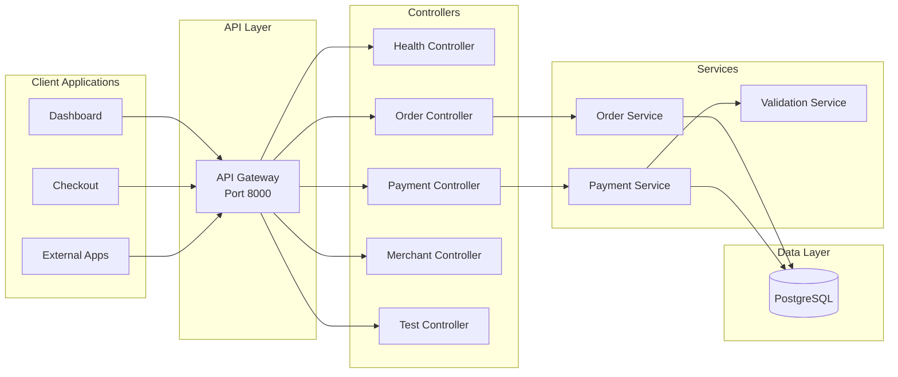
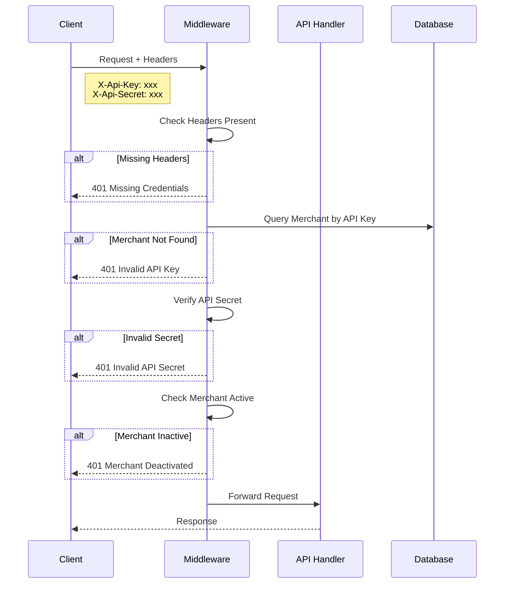
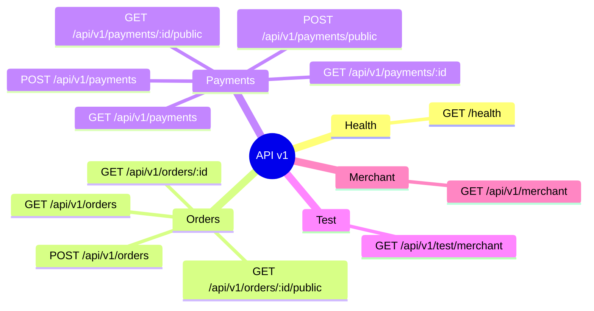
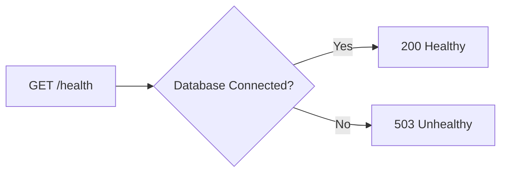
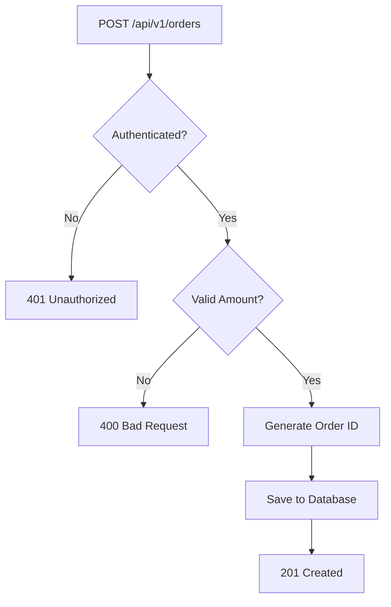
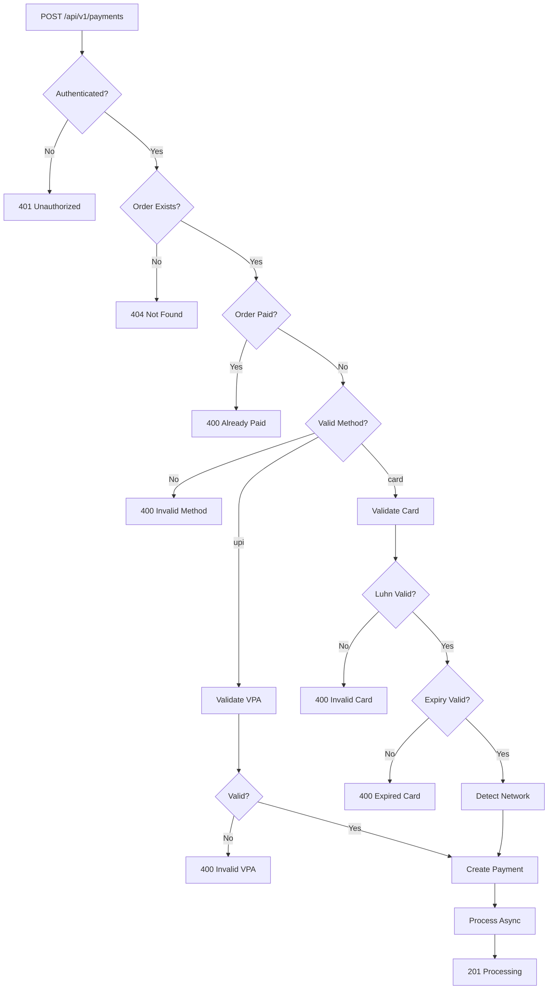
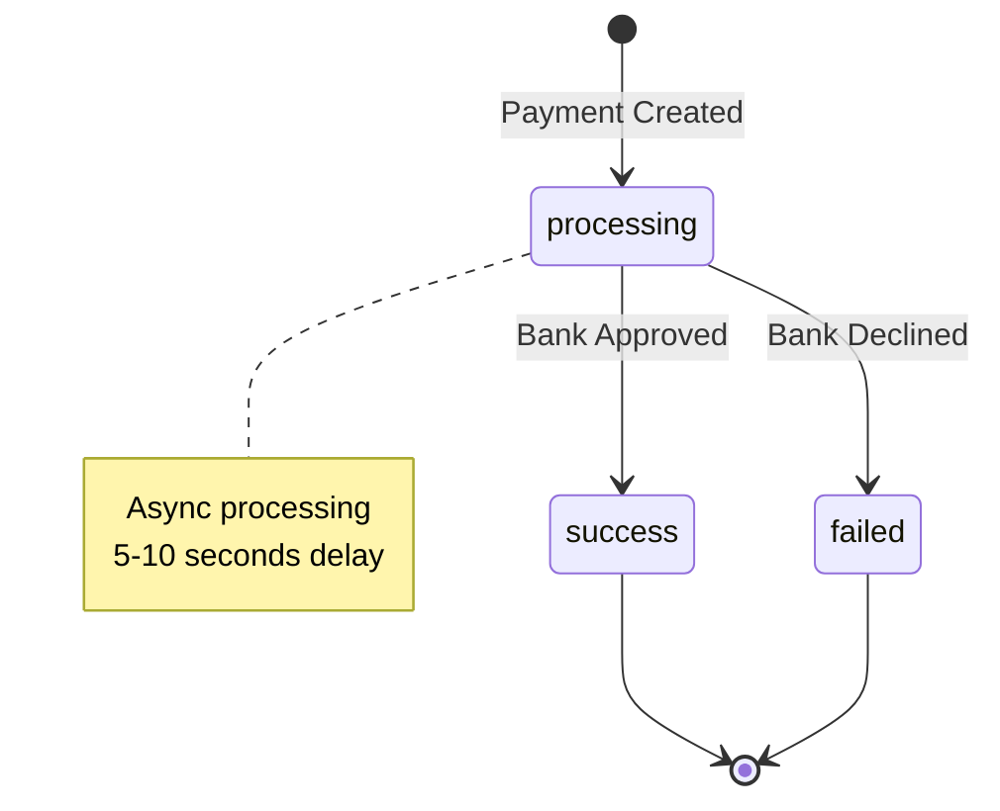
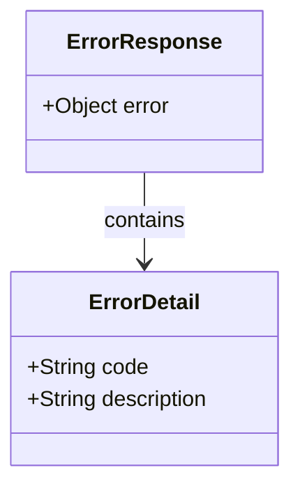
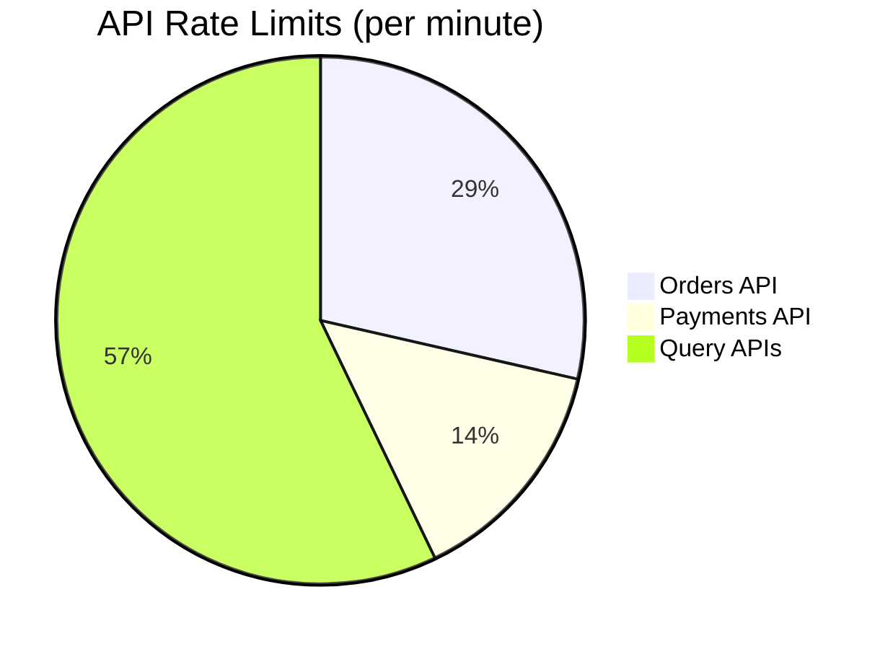

# API Documentation

## Overview

The Payment Gateway API provides RESTful endpoints for managing orders and payments. This document covers all available endpoints, authentication, and usage examples.

## API Architecture



## Authentication Flow



## Endpoint Overview



## Endpoints Detail

### Health Check



**Request:**
```http
GET /health
```

**Response (200):**
```json
{
  "status": "healthy",
  "database": "connected",
  "timestamp": "2024-01-15T10:30:00Z"
}
```

---

### Create Order



**Request:**
```http
POST /api/v1/orders
Content-Type: application/json
X-Api-Key: key_test_abc123
X-Api-Secret: secret_test_xyz789

{
  "amount": 50000,
  "currency": "INR",
  "receipt": "receipt_123",
  "notes": {
    "customer_name": "John Doe"
  }
}
```

**Response (201):**
```json
{
  "id": "order_NXhj67fGH2jk9mPq",
  "merchant_id": "550e8400-e29b-41d4-a716-446655440000",
  "amount": 50000,
  "currency": "INR",
  "receipt": "receipt_123",
  "status": "created",
  "created_at": "2024-01-15T10:30:00Z"
}
```

---

### Create Payment



**UPI Payment Request:**
```http
POST /api/v1/payments
Content-Type: application/json
X-Api-Key: key_test_abc123
X-Api-Secret: secret_test_xyz789

{
  "order_id": "order_NXhj67fGH2jk9mPq",
  "method": "upi",
  "vpa": "user@paytm"
}
```

**Card Payment Request:**
```http
POST /api/v1/payments
Content-Type: application/json
X-Api-Key: key_test_abc123
X-Api-Secret: secret_test_xyz789

{
  "order_id": "order_NXhj67fGH2jk9mPq",
  "method": "card",
  "card": {
    "number": "4111111111111111",
    "expiry_month": "12",
    "expiry_year": "2027",
    "cvv": "123",
    "holder_name": "John Doe"
  }
}
```

**Response (201):**
```json
{
  "id": "pay_H8sK3jD9s2L1pQr",
  "order_id": "order_NXhj67fGH2jk9mPq",
  "amount": 50000,
  "currency": "INR",
  "method": "card",
  "card_network": "visa",
  "card_last4": "1111",
  "status": "processing",
  "created_at": "2024-01-15T10:31:00Z"
}
```

---

## Payment Status Flow



## Error Response Format



**Example Error Response:**
```json
{
  "error": {
    "code": "BAD_REQUEST_ERROR",
    "description": "Amount must be at least 100 paise"
  }
}
```

## Error Codes

| Code | HTTP Status | Description |
|------|-------------|-------------|
| `AUTHENTICATION_ERROR` | 401 | Missing or invalid API credentials |
| `BAD_REQUEST_ERROR` | 400 | Validation error in request |
| `NOT_FOUND_ERROR` | 404 | Resource not found |
| `INVALID_VPA` | 400 | UPI VPA format is invalid |
| `INVALID_CARD` | 400 | Card number failed Luhn validation |
| `EXPIRED_CARD` | 400 | Card expiry date is in the past |
| `INTERNAL_ERROR` | 500 | Server error |

## Rate Limits



> **Note:** Current implementation does not enforce rate limits. These are recommended limits for production deployment.
