# Architecture Documentation

## System Architecture Overview

This document provides a comprehensive overview of the Payment Gateway architecture, including system components, data flow, and deployment structure.

## High-Level Architecture

```mermaid
graph TB
    subgraph "External Actors"
        M[🏪 Merchant<br/>API Consumer]
        C[👤 Customer<br/>End User]
    end
    
    subgraph "Load Balancer / Reverse Proxy"
        LB[📡 Nginx]
    end
    
    subgraph "Application Layer"
        direction TB
        subgraph "Frontend Services"
            DASH[💻 Dashboard<br/>React SPA]
            CHECK[🛒 Checkout<br/>React SPA]
        end
        
        subgraph "Backend Services"
            API[⚙️ API Server<br/>Node.js/Express]
        end
    end
    
    subgraph "Data Layer"
        DB[(🗄️ PostgreSQL<br/>Primary Database)]
    end
    
    M -->|HTTPS| LB
    C -->|HTTPS| LB
    LB -->|Port 3000| DASH
    LB -->|Port 3001| CHECK
    LB -->|Port 8000| API
    DASH -->|REST API| API
    CHECK -->|REST API| API
    API -->|SQL| DB
    
    style M fill:#ffd700
    style C fill:#90EE90
    style DASH fill:#61dafb
    style CHECK fill:#ff6b6b
    style API fill:#68a063
    style DB fill:#336791
```

## Component Architecture

### Backend API Architecture

```mermaid
graph TD
    subgraph "Express Application"
        MW[🔐 Middleware Layer]
        
        subgraph "Route Handlers"
            HR["/health"]
            OR["/api/v1/orders"]
            PR["/api/v1/payments"]
            MR["/api/v1/merchant"]
            TR["/api/v1/test"]
        end
        
        subgraph "Controllers"
            HC[Health Controller]
            OC[Order Controller]
            PC[Payment Controller]
            MC[Merchant Controller]
            TC[Test Controller]
        end
        
        subgraph "Services"
            OS[Order Service]
            PS[Payment Service]
            VS[Validation Service]
        end
        
        subgraph "Data Access"
            DB[Database Pool]
        end
    end
    
    MW --> HR & OR & PR & MR & TR
    HR --> HC
    OR --> OC --> OS
    PR --> PC --> PS
    MR --> MC
    TR --> TC
    PS --> VS
    OS & PS --> DB
    
    style MW fill:#ffeb3b
    style VS fill:#e1bee7
```

### Frontend Dashboard Architecture

### Checkout Page Architecture

## Request Flow Architecture

### Order Creation Flow

### Payment Processing Flow

## Deployment Architecture

### Docker Compose Setup

### Container Dependencies

```mermaid
graph LR
    subgraph "Startup Order"
        PG[1️⃣ PostgreSQL]
        API[2️⃣ API Server]
        DASH[3️⃣ Dashboard]
        CHECK[3️⃣ Checkout]
    end
    
    PG -->|healthy| API
    API -->|started| DASH
    API -->|started| CHECK
```

### Build Pipeline

## Security Architecture

### Authentication Flow

```mermaid
flowchart TD
    A[API Request] --> B{Has Auth Headers?}
    B -->|No| C[401 Unauthorized]
    B -->|Yes| D[Extract Credentials]
    D --> E{Valid API Key?}
    E -->|No| F[401 Invalid Key]
    E -->|Yes| G{Valid Secret?}
    G -->|No| H[401 Invalid Secret]
    G -->|Yes| I{Merchant Active?}
    I -->|No| J[401 Deactivated]
    I -->|Yes| K[✅ Proceed]
    
    style C fill:#ffcdd2
    style F fill:#ffcdd2
    style H fill:#ffcdd2
    style J fill:#ffcdd2
    style K fill:#c8e6c9
```

### Data Security

## Scalability Considerations

### Horizontal Scaling

### Caching Strategy (Future)

## Monitoring Points

## Technology Stack Summary

