# Database Schema Documentation

## Overview

The Payment Gateway uses PostgreSQL as its primary database. This document describes the database schema, relationships, and data flow.

## Entity Relationship Diagram

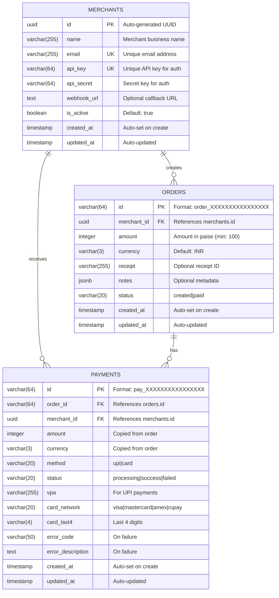

## Table Details

### Merchants Table

Stores merchant account information and API credentials.

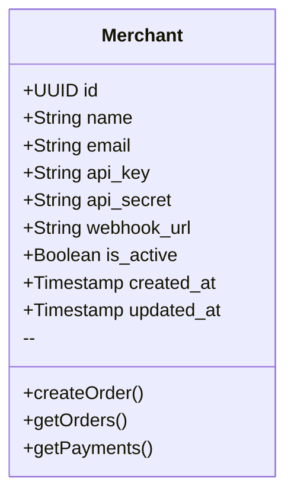

| Column | Type | Constraints | Description |
|--------|------|-------------|-------------|
| `id` | UUID | PRIMARY KEY, DEFAULT gen_random_uuid() | Unique identifier |
| `name` | VARCHAR(255) | NOT NULL | Business name |
| `email` | VARCHAR(255) | NOT NULL, UNIQUE | Contact email |
| `api_key` | VARCHAR(64) | NOT NULL, UNIQUE | API authentication key |
| `api_secret` | VARCHAR(64) | NOT NULL | API secret for validation |
| `webhook_url` | TEXT | NULLABLE | Callback URL for events |
| `is_active` | BOOLEAN | DEFAULT TRUE | Account status |
| `created_at` | TIMESTAMP | DEFAULT CURRENT_TIMESTAMP | Creation time |
| `updated_at` | TIMESTAMP | DEFAULT CURRENT_TIMESTAMP | Last update time |

### Orders Table

Stores payment order information created by merchants.

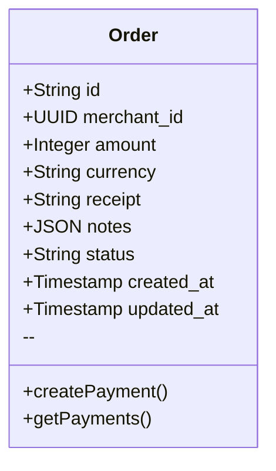

| Column | Type | Constraints | Description |
|--------|------|-------------|-------------|
| `id` | VARCHAR(64) | PRIMARY KEY | Format: `order_XXXXXXXXXXXXXXXX` |
| `merchant_id` | UUID | FOREIGN KEY (merchants.id) | Owner merchant |
| `amount` | INTEGER | NOT NULL, CHECK >= 100 | Amount in paise |
| `currency` | VARCHAR(3) | DEFAULT 'INR' | Currency code |
| `receipt` | VARCHAR(255) | NULLABLE | External reference |
| `notes` | JSONB | NULLABLE | Additional metadata |
| `status` | VARCHAR(20) | DEFAULT 'created' | `created` or `paid` |
| `created_at` | TIMESTAMP | DEFAULT CURRENT_TIMESTAMP | Creation time |
| `updated_at` | TIMESTAMP | DEFAULT CURRENT_TIMESTAMP | Last update time |

### Payments Table

Stores individual payment attempts against orders.

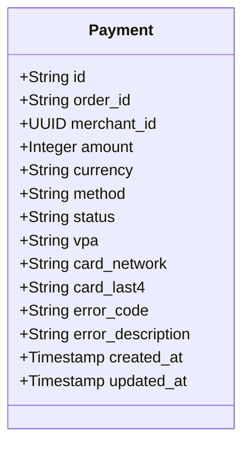

| Column | Type | Constraints | Description |
|--------|------|-------------|-------------|
| `id` | VARCHAR(64) | PRIMARY KEY | Format: `pay_XXXXXXXXXXXXXXXX` |
| `order_id` | VARCHAR(64) | FOREIGN KEY (orders.id) | Associated order |
| `merchant_id` | UUID | FOREIGN KEY (merchants.id) | Owner merchant |
| `amount` | INTEGER | NOT NULL | Payment amount in paise |
| `currency` | VARCHAR(3) | DEFAULT 'INR' | Currency code |
| `method` | VARCHAR(20) | NOT NULL | `upi` or `card` |
| `status` | VARCHAR(20) | NOT NULL | `processing`, `success`, `failed` |
| `vpa` | VARCHAR(255) | NULLABLE | UPI Virtual Payment Address |
| `card_network` | VARCHAR(20) | NULLABLE | `visa`, `mastercard`, `amex`, `rupay` |
| `card_last4` | VARCHAR(4) | NULLABLE | Last 4 card digits |
| `error_code` | VARCHAR(50) | NULLABLE | Error code on failure |
| `error_description` | TEXT | NULLABLE | Error message |
| `created_at` | TIMESTAMP | DEFAULT CURRENT_TIMESTAMP | Creation time |
| `updated_at` | TIMESTAMP | DEFAULT CURRENT_TIMESTAMP | Last update time |

## Data Flow

### Order Creation Flow

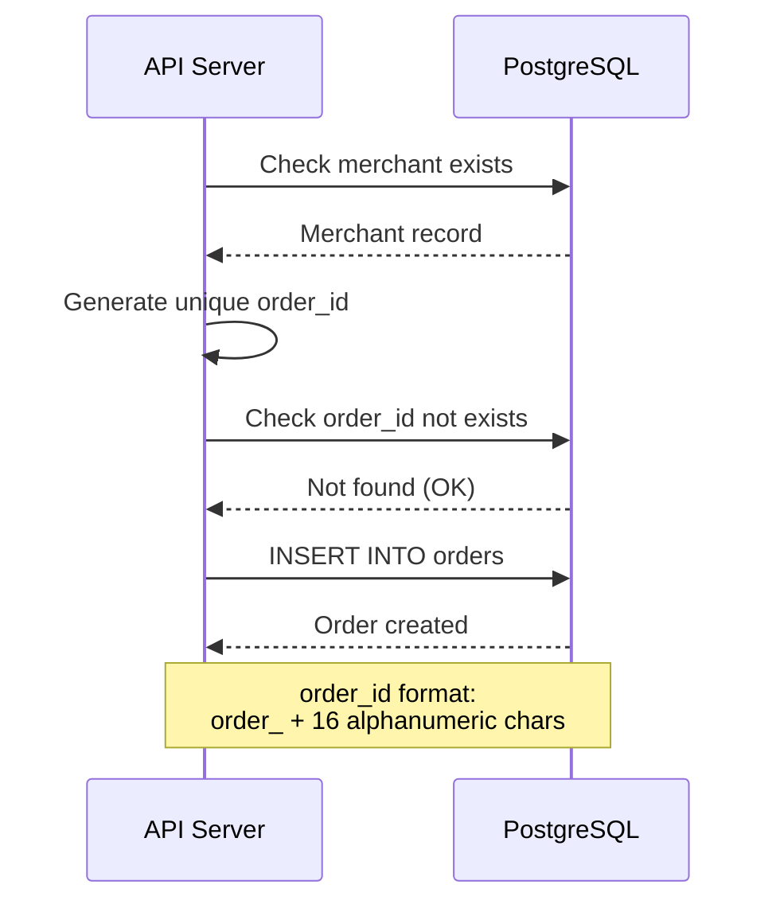

### Payment Creation Flow

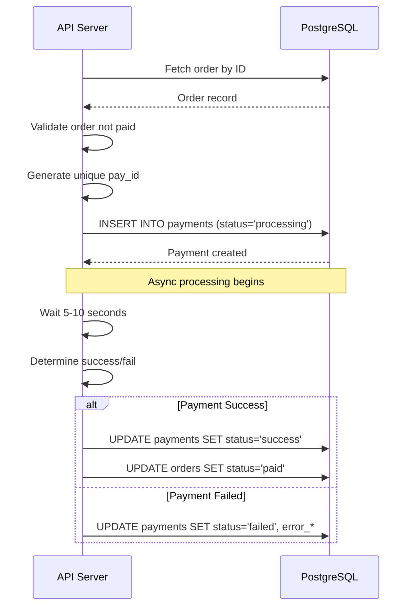

## Status Transitions

### Order Status

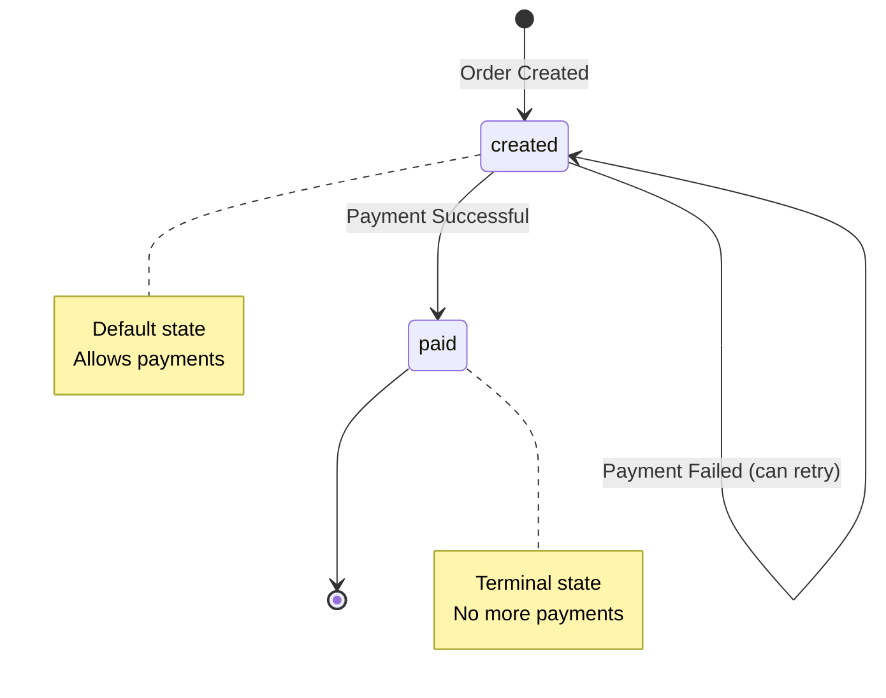

### Payment Status

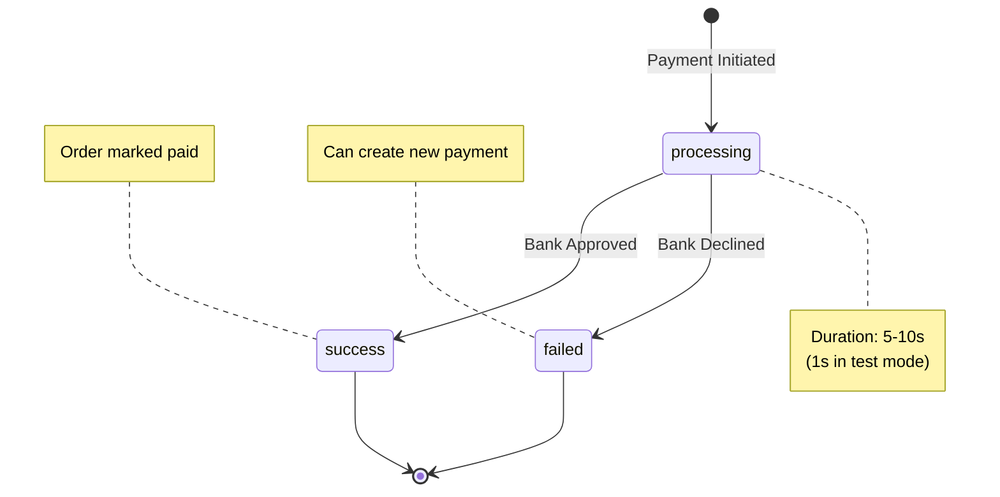

## Indexes

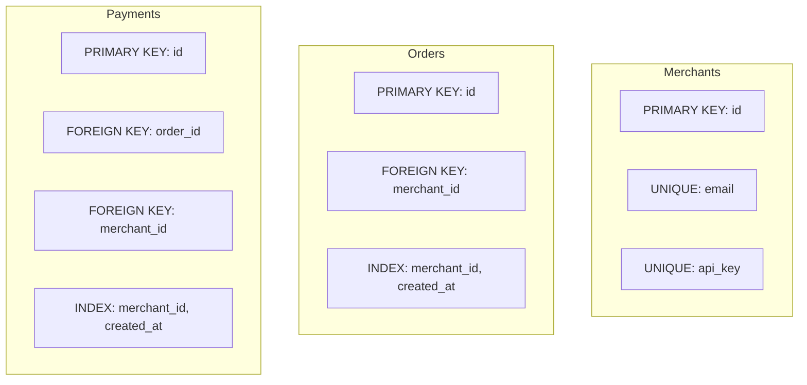

## Database Initialization

On startup, the database is automatically initialized with:

1. **Schema Creation** - All tables created if not exist
2. **Test Merchant Seeding** - Default test merchant created

### Test Merchant Data

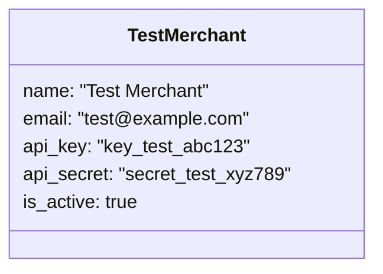

## Connection Pool

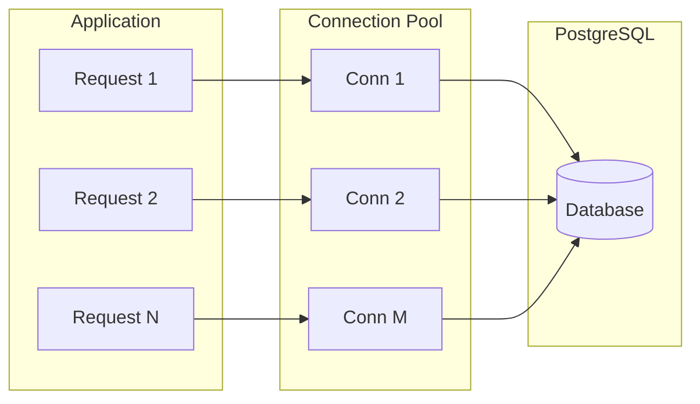

> Pool Size: 20 connections (configurable via `DATABASE_POOL_SIZE`)
